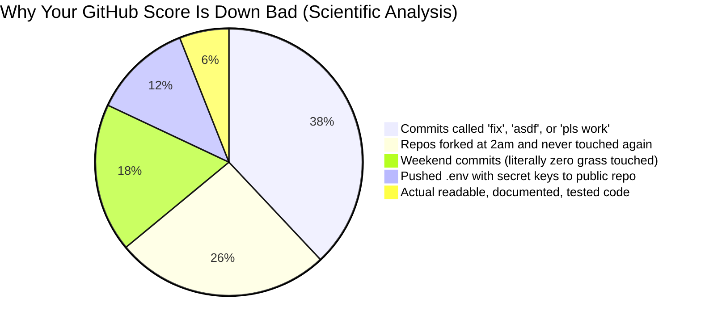
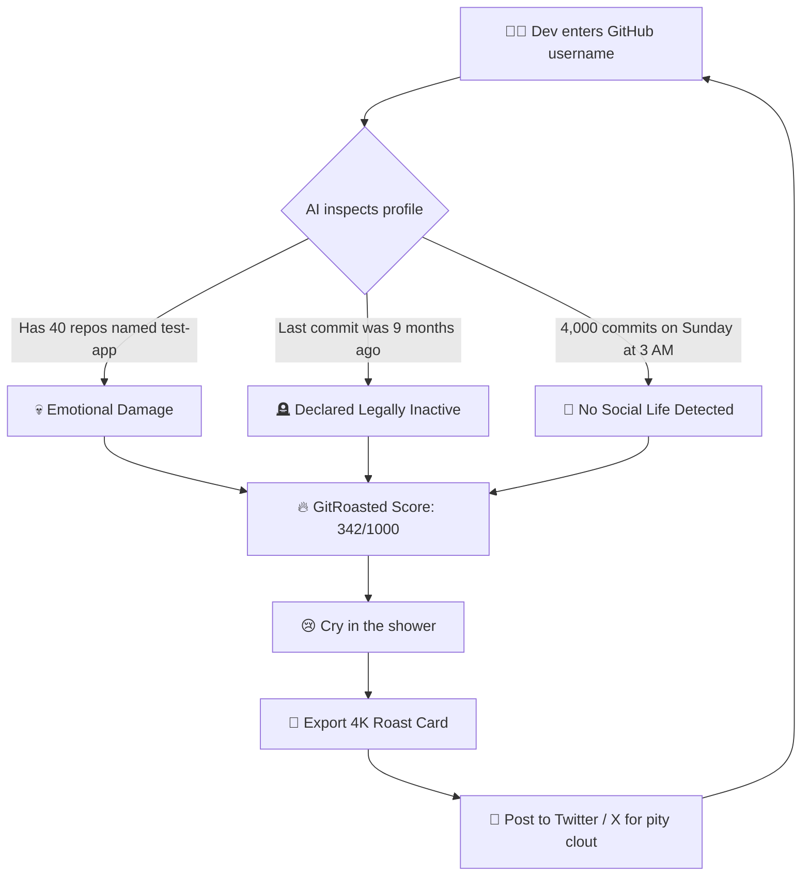
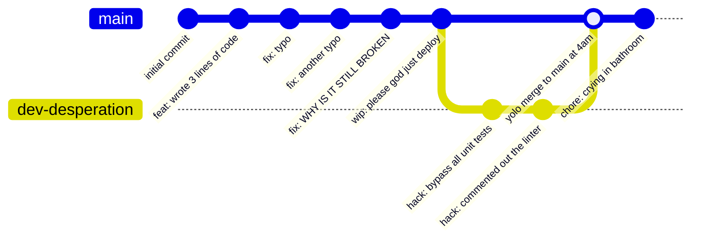
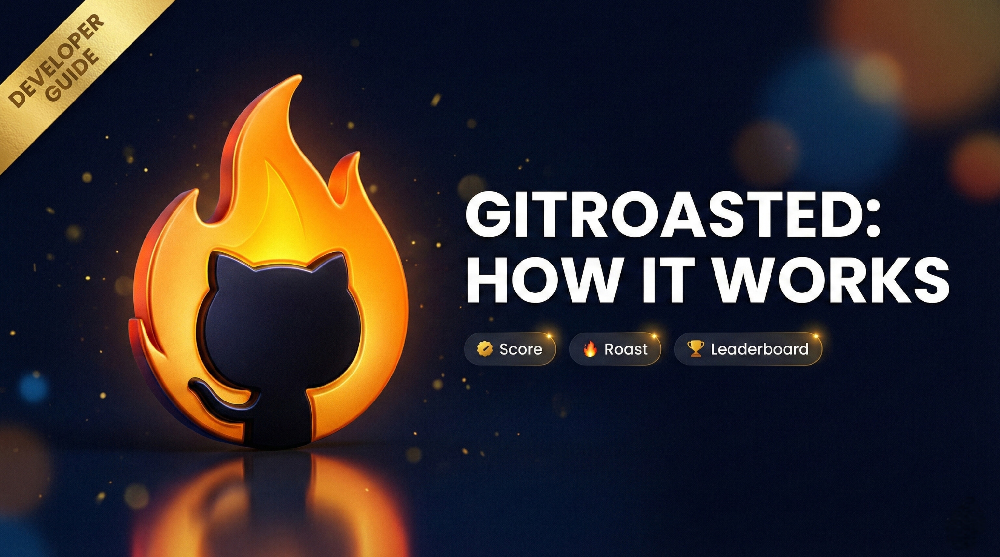
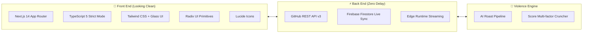

<div align="center">

# 🔥 GitRoasted

### *Bro really thought having 3 green squares made him a senior engineer 💀*

**Get your GitHub developer score out of 1000 and receive emotional damage from AI.**  
*Because somebody had to tell you that forking 400 repos and never touching them is NOT a personality trait, bestie.*

[](https://gitroasted.netlify.app)
[](https://gitroasted.netlify.app)
[](https://gitroasted.netlify.app)
[](https://gitroasted.netlify.app)
[](https://www.producthunt.com/posts/gitroasted)
[](https://opensource.org/licenses/MIT)

<br/>

[-black?style=flat-square&logo=next.js)](https://nextjs.org/)
[-blue?style=flat-square&logo=typescript)](https://www.typescriptlang.org/)
[-orange?style=flat-square&logo=firebase)](https://firebase.google.com/)
[](https://tailwindcss.com/)

[🚀 Get Cooked Live](https://gitroasted.netlify.app) • 
[👑 Creator Twitter/X](https://x.com/md_kasif_uddin) • 
[🍿 Watch Me Suffer (Video)](#-see-it-in-action) • 
[🐛 Expose a Bug](https://github.com/MdKasif0/GitRoasted/issues) • 
[✨ Request More Violence](https://github.com/MdKasif0/GitRoasted/issues)

</div>

---

## 💀 What in the Brainrot is GitRoasted?

GitRoasted is a **100% free, open-source roast machine** that takes your innocent GitHub username and completely decimates your self-esteem using cold, hard git metrics and an AI with zero filter.

You pull up thinking you're the next Linus Torvalds.  
You leave questioning your entire university degree.

```
       BEFORE GITROASTED                      AFTER GITROASTED
   ┌───────────────────────┐              ┌───────────────────────┐
   │ "My code is clean af" │              │ "Maybe farming was    │
   │ "Top 1% dev honestly" │  ─────────>  │  my real calling..."  │
   │ "Recruiters love me"  │              │ "I lost all my aura"  │
   └───────────────────────┘              └───────────────────────┘
```

---

## 📊 Scientific Data on Why You're Cooked (Charts & Graphs)

We ran the algorithms, checked the logs, and crunched the numbers. Here are the peer-reviewed results:

### 1. 🥧 The Anatomy of a Low GitHub Score



---

### 2. 🔄 The Cycle of Humiliation (User Journey)



---

### 3. 🌲 Actual Footage of Your Git Tree



---

### 4. 📈 Developer Coping Mechanism Index

```
Reason for your terrible score:
"My actual good code is in private repos"  [██████████████████████████] 92% (CAP)
"GitHub star count is a vanity metric"    [███████████████████░░░░░░░] 74% (COPE)
"The AI just doesn't understand my vision"[██████████████░░░░░░░░░░░░] 55% (DELULU)
"I touch grass on weekends"               [████░░░░░░░░░░░░░░░░░░░░░░] 14% (FALSE)
"I have an actual skill issue"            [█░░░░░░░░░░░░░░░░░░░░░░░░░]  3% (HONEST)
```

```
Confidence level during the roast process:
Before typing username:  [████████████████████] 100% ("I'm basically god's gift to tech")
While AI is thinking:    [██████████░░░░░░░░░░]  50% ("Wait what if it checks my commits")
Reading roast summary:   [██░░░░░░░░░░░░░░░░░░]  10% ("Bro it brought up that repo from 2021")
Viewing final score:     [░░░░░░░░░░░░░░░░░░░░]   0% ("Applying to Wendy's immediately")
```

---

## 🎥 See It in Action

<div align="center">

<a href="https://youtu.be/XzzdQJDsYOw">
  
</a>

*👆 Click to watch the official tutorial before your feelings get hurt*

</div>

### Quick Run:
1. Hit up [gitroasted.netlify.app](https://gitroasted.netlify.app)
2. Enter any GitHub username (yours, your boss's, your rival's)
3. Receive certified organic emotional damage in < 3 seconds!

---

## 🔥 Features (The Arsenal of Disrespect)

### Core Roast Arsenal
- 🎯 **100+ Data Point X-Ray** - We inspect repos, commit times, forks, stars, PRs, and dirty git secrets.
- 🤖 **AI-Powered Murder** - 2-3 sentence lethal roasts personalized to your exact git sins.
- 📊 **The 1000-Point Aura System** - Objective evaluation across 8 dimensions. No cap.
- 🏆 **The Tryhard Olympics (Leaderboard)** - Compete with basement-dwellers globally for #1.
- ⚔️ **1v1 Developer Battles** - Put two usernames in the cage and let AI pick who gets fired first.
- 💡 **Quick Wins (Damage Control)** - Actionable steps so your resume stops looking like a crime scene.
- 🎨 **Figma-Grade Share Cards** - Export your humiliation in 1:1, 16:9, or 3:4 with custom themes for Twitter/LinkedIn.
- 🌙 **Dark/Light Mode** - For developers whose retinas can only handle 0.5 nits of brightness.

---

## 🧮 Aura Breakdown (Scoring Algorithm)

You start with a theoretical **1000 points**. Most mortals get humbled real quick:

| Metric | Max Aura | The Harsh Reality Check |
|---|:---:|---|
| 💫 **Impact** | **250** | 0 stars, and the only fork was your mom testing if the link worked |
| 🔥 **Consistency** | **200** | Green squares looking like Morse code for "I give up" |
| ✨ **Quality** | **150** | Zero tests written, 45 warnings suppressed with `// @ts-ignore` |
| 👥 **Community** | **150** | 3 followers: a crypto bot, your second account, and GitHub Dependabot |
| 🌈 **Diversity** | **100** | 98% HTML/CSS, 2% vibes. Claims to be "Full Stack" on LinkedIn |
| 📅 **Experience** | **75** | Account created in 2019, literally 5 commits total |
| ⚡ **Activity** | **50** | Hasn't touched a terminal in 4 months |
| 🏆 **Bonuses** | **25** | Pushed a commit on New Year's Eve at 11:59 PM (seek help) |

### Score Tier Slander

```
👑 900 - 1000  ->  "GitHub Legend"      (Has forgotten what the sun looks like)
⭐ 800 - 899   ->  "Star Developer"     (Probably dreams in Rust syntax)
💪 700 - 799   ->  "Certified Cooker"   (Actually writes tests, what a nerd)
👍 600 - 699   ->  "Mid, but Surviving" (StackOverflow clipboard warrior)
📈 400 - 599   ->  "Average NPC"        (Writes 'feat: update' for 80th time)
🌱 000 - 399   ->  "Terminal Illness"   (Bro cloned 50 repos and closed laptop)
```

---

## 🛠️ The Tech Stack (What We Cooked With)



- **Next.js 14**: Because we love server components fighting our client state at 3am.
- **TypeScript 5**: To ensure your low score is delivered with 100% type safety.
- **Tailwind CSS**: Because hand-writing 12 CSS files gives us the ick.
- **Firebase Firestore**: Real-time leaderboard so you can watch people pass you in real-time.
- **HTML5 Canvas**: To bake your roast cards into crisp images ready for Twitter clout.

---

## ⚡ Quick Start (If You Actually Know How to Code)

Wanna run this locally and roast your coworkers? Easy money:

### 1. Steal the Code
```bash
git clone https://github.com/MdKasif0/GitRoasted.git
cd GitRoasted
```

### 2. Feed the Node Monolith
```bash
npm install
```

### 3. Hand Over the Secrets
Create a `.env.local` file in the root. Don't push this to GitHub, we WILL roast you for it:

```env
# Firebase credentials (for leaderboard clout)
NEXT_PUBLIC_FIREBASE_API_KEY=your_firebase_key
NEXT_PUBLIC_FIREBASE_AUTH_DOMAIN=your_project.firebaseapp.com
NEXT_PUBLIC_FIREBASE_PROJECT_ID=your_project_id
NEXT_PUBLIC_FIREBASE_STORAGE_BUCKET=your_project.appspot.com
NEXT_PUBLIC_FIREBASE_MESSAGING_SENDER_ID=your_sender_id
NEXT_PUBLIC_FIREBASE_APP_ID=your_app_id

# GitHub Token (Optional, unless you wanna hit the 60 req/hr rate limit wall)
GITHUB_TOKEN=ghp_yourPersonalAccessTokenHere

# Google Analytics (Optional)
NEXT_PUBLIC_GA_MEASUREMENT_ID=G-XXXXXXXXXX
```

### 4. Ignite the Chaos
```bash
npm run dev
```

Open [http://localhost:3000](http://localhost:3000) and prepare yourself emotionally.

---

## 🚢 How to Deploy (Send It)

### Deploying to Netlify (Recommended)
Hit the button, link your repo, paste your env vars, boom. Instant emotional damage globally hosted.

[](https://app.netlify.com/start/deploy?repository=https://github.com/MdKasif0/GitRoasted)

### Deploying to Diploi
[](https://diploi.com/launch/MdKasif0/GitRoasted)

### Deploying to Vercel
```bash
npm i -g vercel
vercel
```

---

## 🙋 Frequently Annoying Questions (FAQ)

<details>
<summary><b>Q: Why is my score so low? The algorithm is broken!</b></summary>
<p>A: Classic skill issue. The algorithm is fine, your commit messages are just "update readme" 47 times in a row.</p>
</details>

<details>
<summary><b>Q: Is GitRoasted free?</b></summary>
<p>A: 100% free. Emotional damage shouldn't come with a subscription fee.</p>
</details>

<details>
<summary><b>Q: Does this read my private repos?</b></summary>
<p>A: No. We only roast the crimes you committed in public. Your secret unfinished million-dollar startup ideas are safe.</p>
</details>

<details>
<summary><b>Q: How do I improve my score?</b></summary>
<p>A: Write actual documentation, stop committing directly to main, contribute to open source, and occasionally touch real grass.</p>
</details>

<details>
<summary><b>Q: Can I embed my roast card on my GitHub profile?</b></summary>
<p>A: Absolutely. Self-deprecating humor is a senior engineer trait:
<br/>
<code>[](https://gitroasted.netlify.app)</code>
</p>
</details>

---

## 🤝 Contributing (Pull Up, Bestie)

Found a bug? Want to write even more unhinged AI roasts? We welcome PRs with open arms.

1. Fork the repo (and actually edit it this time, don't just leave it sitting there)
2. Create your branch: `git checkout -b feature/more-violence`
3. Commit your changes: `git commit -m "feat: added 10x emotional damage"`
4. Push: `git push origin feature/more-violence`
5. Open a PR and pray the linter doesn't roast you.

---

## 🌟 Stalk the Star History

If you laughed or cried while using this, give the repo a star. It releases dopamine directly into our bloodstream:

[](https://star-history.com/#MdKasif0/GitRoasted&Date)

---

## 📜 Legal / MIT License

```
MIT License

Copyright (c) 2024 GitRoasted

Permission is hereby granted, free of charge, to anyone who stumbles upon this code,
to use, copy, modify, merge, publish, distribute, sublicense, and/or sell copies.
Just don't sue us when your boss finds out your GitHub score is 214.
```

---

<div align="center">

### Built with 🔥 and zero emotional stability by [Md Kasif](https://github.com/MdKasif0)

**[gitroasted.netlify.app](https://gitroasted.netlify.app)** • **[Follow on X/Twitter](https://x.com/md_kasif_uddin)**

*Remember: Code is temporary, but the git blame is forever.*

</div>
